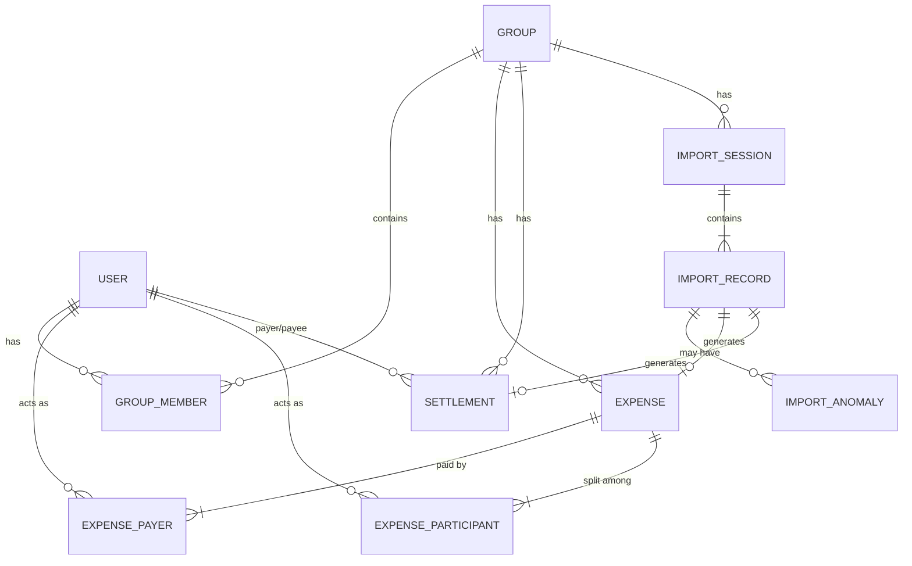

# Architectural Decisions

## 1. Decimal Types for Financial Data
**Decision**: Use `Decimal` types (via `decimal.js` for pure engine logic, mapping to PostgreSQL `DECIMAL`) instead of `Float` for all monetary amounts.
**Rationale**: The CSV contains values like `899.995` (Row 10). Floating-point numbers can introduce rounding errors. Financial applications require strict precision, which `Decimal` guarantees.

## 2. Temporal/Event-Sourced Membership Tracking
**Decision**: Track `joinedAt` and `leftAt` timestamps on the `GroupMember` entity.
**Rationale**: CSV analysis proved this is critical. Meera moved out on March 28th (Row 33), but was erroneously charged for April groceries (Row 36). Sam moved in on April 8th (Row 38) and should not be billed for March expenses. Using temporal bounds prevents historical alterations and blocks invalid future charges.

## 3. Strict Separation of Expenses and Settlements
**Decision**: `Expense` and `Settlement` are separate entities in the database schema.
**Rationale**: Row 14 ("Rohan paid Aisha back", 5000 INR) and Row 38 ("Sam deposit share") are mathematically transfers, not shared costs. Mixing them complicates UI filtering, invalidates `split_type` logic, and obfuscates total "group spend".

## 4. Immutable Import Records & Multi-Stage Resolution
**Decision**: CSV uploads create `ImportRecord` rows containing the exact JSON representation of the uploaded row. `ImportAnomaly` records flag issues, and `ImportSession` coordinates the review.
**Rationale**:
- **Conflicting Duplicates**: Rows 24 and 25 are conflicts for the same dinner by different payers. The system cannot auto-guess the truth; it must show both raw records to the user and mark as `CONFLICTING_DUPLICATE`.
- **Near Duplicates**: Will never be auto-deleted, instead marked `PENDING_REVIEW`.
- **Missing Payers**: Do not import into Expense table. Hold in ImportSession pending review.
- **Auditability**: If a user corrects the 110% percentage split (Row 15, 32) during import, we must retain the original uploaded data.
- **Data Provenance**: Negative refunds (Row 26) are safely held and flagged. Zero-dollar transactions (Row 31) require manual review.

## 5. Support for 'Shares' Split Type
**Decision**: Implement a `SHARES` split type in the database and service layer alongside `EQUAL`, `EXACT`, and `PERCENTAGE`.
**Rationale**: Row 22 ("Scooter rentals", Aisha 1; Rohan 2; Priya 1; Dev 2) and Row 35 ("April rent") utilize a custom ratio / share-based split. Attempting to convert shares to percentages often yields repeating decimals (e.g., 1/6 = 16.666%), which introduces rounding errors. Native share support avoids this.

## Entity Relationship Diagram (ERD)

